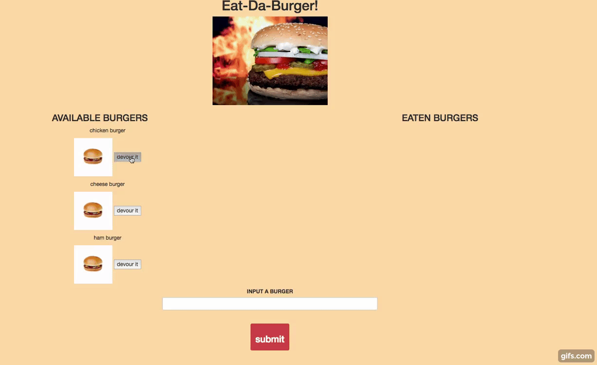

# Burgers

##### A node mysql application using express to create a burger display system.

Instructions:

1) The user sees available burgers and eaten burgers

2) When devour button is click a mysql update custom made ORM function is triggered and the burger is displayed in the eaten section.

3) The user has an option to input a burger. When the submit button is clicked a mysql insert custom made ORM function is triggered and the burger is displayed in the available section.

______________________________________________________________________________________________________________________________

here is the link to the live site: https://polar-anchorage-18800.herokuapp.com/
______________________________________________________________________________________________________________________________

Technologies Used:

1) NODE-JS
2) EXPRESS-JS
3) MYSQL
3) JQUERY
4) HTTP PROTOCOL
5) HANDLEBARS.JS/BOOTSRAP
6) CSS
______________________________________________________________________________________________________________________________
gif:

